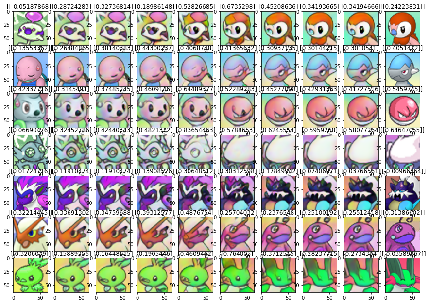

# Adversarially-Constrained-Autoencoder-Interpolation
Replication of the paper "Understanding and Improving Interpolation in Autoencoders via an Adversarial Regularizer" by Berthelot et al. applied to a pokemon dataset.

The architecture can do realistic interpolation in images by interpolating in the latent space of an autoencoder instead of in pixel space. 

However, standard autoencoders do not work well for this task, often generating unrealistic interpolations or ones that are very similar to a pixel-level interpolation.

This paper helps reduce this problem by using an adversarial network that works as a regularizer and encourages interpolations to be indistinguishable from non-interpolated image reconstructions.

Below are some preliminary results with a dataset of Pokemon:

